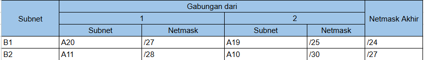
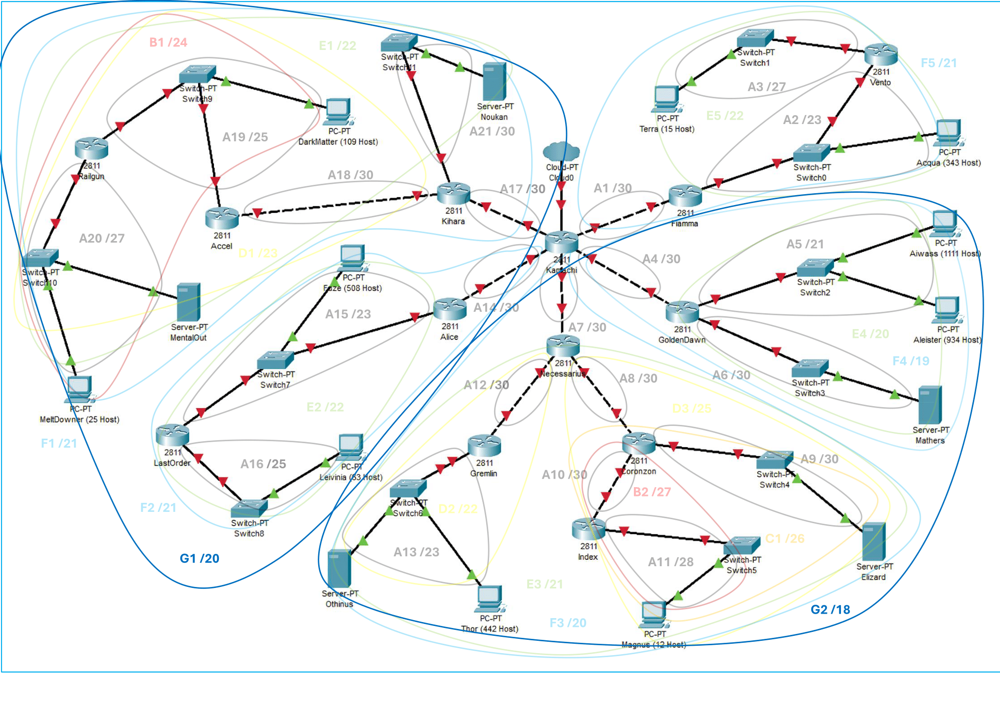

[](https://classroom.github.com/a/J0PlZqkZ)

| Name                 | NRP        | Kelas                 |
| -------------------- | ---------- | --------------------- |
| Nuril Qolbi Zam Zami | 5025221296 | Jaringan Komputer (A) |
| Alvin Zanua Putra    | 5025231064 | Jaringan Komputer (A) |


LINK ANEH ANEH nya DISINI :
https://drive.google.com/drive/folders/10ARgZs6oTQcR-GPuFB6xQk4eRxUrcdqu

<br>

<b> Letakkan link excel hasil perhitungan di sini </b>
<br>
<b> _Place the excel calculation results link here_ </b>

```

```

# Laporan Praktikum Modul 4 Non Terraform

## Prefix IP

Letakkan prefix IP yang digunakan di bawah:

_Put IP prefix used below:_

```

```

## Topology

- GNS3

  `Put topology image here`

- CPT

  `Put topology image here`

<br>

## Routing

- Routing table

  `Put your routing table here || Masukkan tabel rutemu di sini`

- Route visualization in topology

  `Draw your routing in the topology and put it here || Masukkan gambar pembagian rute pada topologi di sini`

<br>

## CIDR


### Tree

- Tree image

  `Put your tree image here || Masukkan gambar tree di sini`

- IP distribution table

  `Put your IP distribution based on the tree here || Masukkan tabel distribusi IP berdasarkan tree di sini`

### Subnet Merging Iteration


- Iteration 0


- Iteration 1

Setelah melihat-lihat pada gambar Merge-0 atau Routing Visualization Awal, dapat dilihat Subnet A11 dan A20 mempunyai jarak terjauh, dengan harus melalui 3 subnet untuk sampai di Router Root.




- Iteration 2


- Iteration 3


- Iteration 4


- Iteration 5


- Iteration 6




- Iteration 7


- Iteration 8


### Subnetting (If you use CPT)

`Put your subnetting configuration for each router, client, and server visualized in topology here || Masukkan konfigurasi untuk masing-masing router, client, dan server yang divisualisasikan pada topologi di sini`

- Kamachi:

  ```
    Put your configuration here
  ```

- Fiamma:

  ```
    Put your configuration here
  ```

- GoldenDawn:

  ```
    Put your configuration here
  ```

- Necessarius:

  ```
    Put your configuration here
  ```

- Alice:

  ```
    Put your configuration here
  ```

- Kihara:

  ```
    Put your configuration here
  ```

- Vento:

  ```
    Put your configuration here
  ```

- Terra:

  ```
    Put your configuration here
  ```

- Acqua:

  ```
    Put your configuration here
  ```

- Aiwass:

  ```
    Put your configuration here
  ```

- Aleister:

  ```
    Put your configuration here
  ```

- Mathers:

  ```
    Put your configuration here
  ```

- Coronzon:

  ```
    Put your configuration here
  ```

- Elizard:

  ```
    Put your configuration here
  ```

- Index:

  ```
    Put your configuration here
  ```

- Magnus:

  ```
    Put your configuration here
  ```

- Gremlin:

  ```
    Put your configuration here
  ```

- Thor:

  ```
    Put your configuration here
  ```

- Othinus:

  ```
    Put your configuration here
  ```

- LastOrder:

  ```
    Put your configuration here
  ```

- Leivinia:

  ```
    Put your configuration here
  ```

- Fuze:

  ```
    Put your configuration here
  ```

- Accel:

  ```
    Put your configuration here
  ```

- Railgun:

  ```
    Put your configuration here
  ```

- MeltDowner:

  ```
    Put your configuration here
  ```

- MentalOut:

  ```
    Put your configuration here
  ```

- DarkMatter:

  ```
    Put your configuration here
  ```

- Noukan:

  ```
    Put your configuration here
  ```

### Routing

Configuration to every router for routing.

- Kamachi:

  ```
    Put your configuration here
  ```

- Fiamma:

  ```
    Put your configuration here
  ```

- GoldenDawn:

  ```
    Put your configuration here
  ```

- Necessarius:

  ```
    Put your configuration here
  ```

- Alice:

  ```
    Put your configuration here
  ```

- Kihara:

  ```
    Put your configuration here
  ```

- Vento:

  ```
    Put your configuration here
  ```

- Coronzon:

  ```
    Put your configuration here
  ```

- Index:

  ```
    Put your configuration here
  ```

- Gremlin:

  ```
    Put your configuration here
  ```

- LastOrder:

  ```
    Put your configuration here
  ```

- Accel:

  ```
    Put your configuration here
  ```

- Railgun:

  ```
    Put your configuration here
  ```

### Testing

- Client - client

  `Put your testing screenshot in here`

- Client - Server

  `Put your testing screenshot in here`

- Client - Router

  `Put your testing screenshot in here`

- Server - Server

  `Put your testing screenshot in here`

- Server - Router

  `Put your testing screenshot in here`

- Router - Router

  `Put your testing screenshot in here`

<br>
  
## Problems

<br>

## Revisions (if any)
